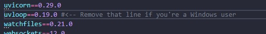

# Star Hacks AI
DEMO: https://drive.google.com/file/d/1lJz38OC77AnDn4010FoMDehQmAET_EBx/view?usp=sharing

# CAPTURAS


- Aplicación desplegada (Prototipo funcional en línea)
https://starhack.vercel.app/
- Prototipo de Figma de una conversación (Figma)
https://www.figma.com/design/UPnqGwD8C9VOExQY7sWzYT/Match-AI?node-id=0-1&t=KVmHBUcBpl9mfko1-1
- Integración con Whatsapp (video)
https://drive.google.com/file/d/1_3FerpMjGoPJa_J0kJ1q6fwfsweOOXtb/view?usp=sharing

## Setup desarollo local
El repositorio contiene el backend y frontend de la aplicación. El frontend se encuentra dentro la carpeta web. 
### Backend
Para iniciar por primera vez el backend
1. Crear una copia del archivo `.env.example` llamado `.env` que contenga las API keys y URLs necesarias
2. Crear un entorno virtual en python
```sh
python3 -m venv venv
```
3. Activar el entorno virtual

En Windows:
```sh
.\venv\Scripts\activate
```
En macOS y Linux:
```sh
source venv/bin/activate
```
4. Instalar las dependencias de python

En Windows:


```sh
pip install -r requirements.txt
```
En macOS y Linux:
```sh
pip install -r requirements.txt
```
Con esto ya se puede iniciar el backend en cualquier momento. Para iniciar el server:
```sh
uvicorn main:app --reload
```
Y ya tienes el backend funcionando
> Cada vez que el cierras la terminal, el entorno virtual de python se desactiva. Para ello tendrás que ejecutar el paso 3 una y otra vez que inicies el backend desde una nueva terminal.

Stack:
- LLM: [Gemini](https://ai.google.dev/gemini-api/docs/get-started/python)
- Base de datos: [Qdrant](https://qdrant.tech/documentation/) (leer documentación)
- Framework para API: [FastAPI](https://qdrant.tech/documentation/)
- Lenguaje: Python

### Frontend
Para iniciar el frontend por primera vez
1. Moverse a la carpeta web `cd web`
2. Crear una copia del archivo `.env.example` llamado `.env.local` que contenga las API keys y URLs necesarias
3. Instalar las dependencias de node 
```sh
npm install
```
Con esto, ya se puede correr el frontend cuando sea. 
Para inciar en modo de desarrollo
```sh
npm run dev
```
Para inciar en modo de producción
```sh
npm run build
```
```sh
npm run start
```
